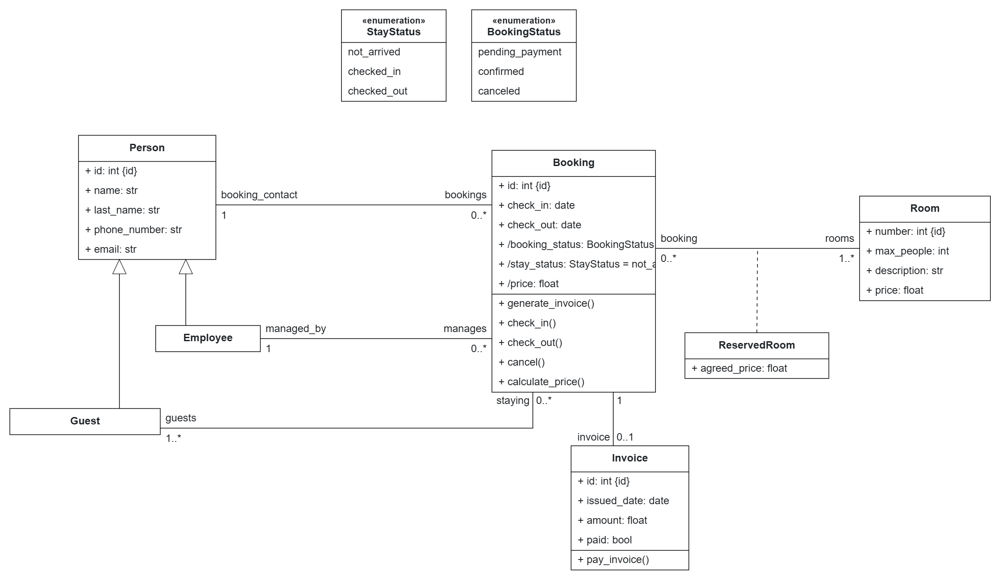

# Low-Code Model

This directory contains the model used as input for the pure low-code development process.

The model is specific to this application and is not provided as an input to the pure agentic development process. For the hybrid development process, the corresponding model is produced by the modeling agent from the [natural-language requirements](../nl-requirements).

Description of the model here....