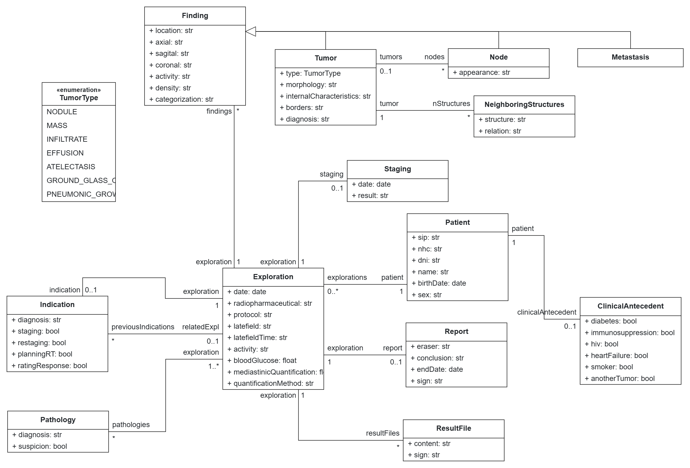

# Low-Code Model - Nuclear Medicine for Lung Cancer

This directory contains the model used as input for the pure low-code development process of a `CRUD web application` for the Nuclear Medicine for Lung Cancer case study.

The model is specific to this application and is not provided as an input to the pure agentic development process. For the hybrid development process, the corresponding model is produced by the modeling agent from the [natural-language requirements](../nl-requirements).

## About the Model

At the heart of the model is the `Exploration`, which represents a PET/CT study performed on a `Patient`. It contains the scan's acquisition details, such as the radiopharmaceutical, protocol, uptake times, and blood glucose. Each `Exploration` is associated with an `Indication`, describing the reason for the study, such as diagnosis, staging, restaging, or treatment planning. An exploration can also refer to a previous indications, keeping the patient's diagnostic history connected over time.

An `Exploration` can reveal one or more `Finding`s, representing relevant observations in the images. These can be specialized as `Tumor`, `Node`, or `Metastasis`. A `Tumor` contains additional information, such as its type, morphology, borders, and a diagnosis. It can also be related to nearby `Node`s and `NeighboringStructures`. Based on these findings, the study produces a `Staging` and a `Report`, with the report backed by one or more `ResultFile`s.

The `Patient` side of the model stores relevant clinical background. A `ClinicalAntecedent` represents comorbidities or risk factors, such as diabetes or smoking history.

## Opening the Project

1. Go to [BESSER Web Editor](https://editor.besser-pearl.org/)
2. Create a new Project
3. Import [Nuclear_Medicine_for_Lung_Cancer.json](Nuclear_Medicine_for_Lung_Cancer.json)
